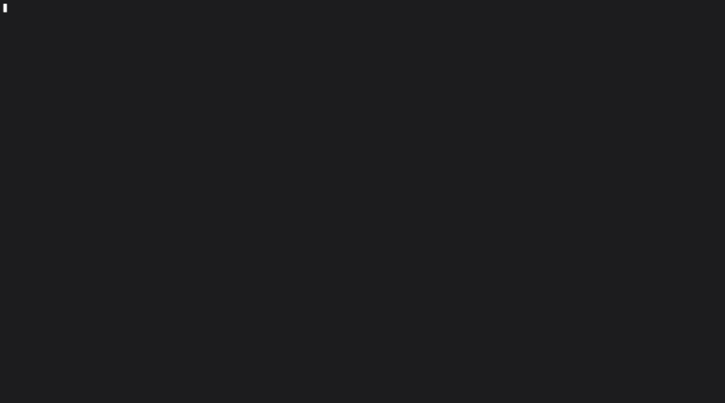

# tfm: The Terminal File Manager for Data Hygiene and Bulk Operations

tfm (Terminal File Manager) is a terminal tool developed in C++ and FXTUI, specializing in cleaning up and efficiently managing large, cluttered file directories.




⚠️ **IMPORTANT SECURITY NOTICE** ⚠️

tfm is a very young project and is in an early development phase. Although the goal is the highest data integrity, we currently do not guarantee flawless operation.

Use at your own risk. Please only use the tool on copies of your data first and back up critical directories before using tfm for cleanup.

## The Motivation:

The idea for tfm arose from the need to clean up a massive Guitar Pro tabs collection (over 219,000 files) that had grown over years and system migrations. This archive contained countless corrupted (0-byte) and duplicate files. tfm is the cornerstone for systematically solving these problems.

The focus of this first version is on data hygiene and freeing up storage space:

## Current Features

Identification of duplicate files:

Uses the FNV-1a hash algorithm to quickly identify files with identical content (e.g., copies created by multiple downloads such as Song.gp and Song (1).gp).

Displays all duplicates in a clear list.

### Interactive deletion:

Allows you to mark and safely delete the identified duplicate files directly in the terminal interface.

### TUI Interface:

The use of the FXTUI framework provides an intuitive, high-performance interface in the terminal.

## Future Plans (Roadmap)

We are continuously expanding tfm. Planned features include:

Display and cleanup of 0-byte files (corrupted files). Recursive Bulk Rename (e.g., replacing spaces with underscores in filenames across multiple folders).

## Installation & Build
tfm is written in C++ and requires compilation.

```bash
# Clone the repository
git clone https://github.com/knasan/terminal_file_manager.git
cd terminal_file_manager

# Create build directory and run CMake
mkdir build
cmake -DBUILD_TUI=ON -B build

# Compile the project
cmake --build build/

# Run tests
./build/tests/tmf-lib_test

# Run tfm
./build/tui/tfm

# install (Simply copy)
cp ./build/tui/tfm to /usr/local/bin/

```

# License & Contributing
This project is released under the MIT License. See LICENSE file in this repo!

We welcome all contributions! Please check out the open issues or submit pull requests to improve tfm.

# TIP
tmf 2>&1 | tee debug.log